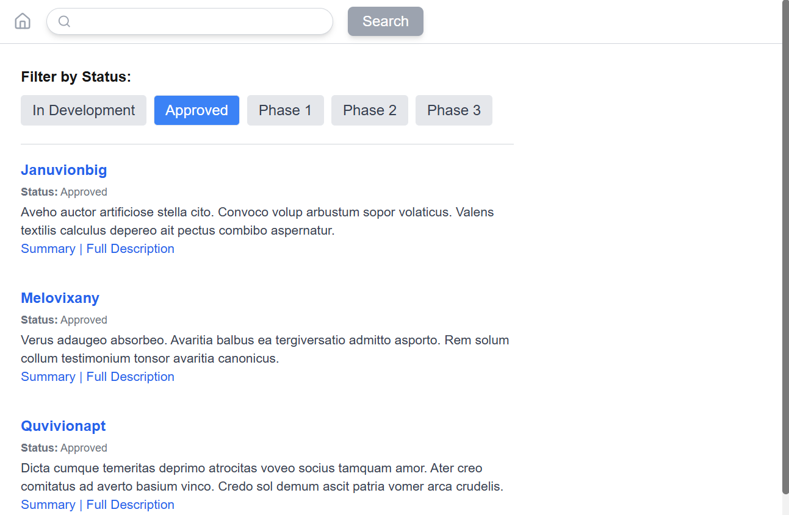

# **Search Next.Js App.**

## **Contents**

- [Key Design Decisions](#key-design-decisions)
- [Installing the project](#installing-the-project)

## **Project Description**

This project is a simple TEST engine search application built with **Next.js 15**, **TypeScript** and **TailwindCSS**.  
A few screenshots:  




**Key Technologies**

- **Next.js**: A React framework that offers **server-side rendering (SSR)** and **static site generation (SSG)** out of the box, helping with SEO and performance optimization.
- **TypeScript**: Adds static typing to JavaScript, improving code quality, reducing errors, and enabling better collaboration.
- **TailwindCSS**: A utility-first CSS framework used to create responsive and maintainable designs.
- **ESLint**: A linting tool for ensuring clean, consistent, and error-free code.
- **Prettier**: An opinionated code formatter that automatically formats the code to maintain consistent style.
- **Webpack (under Next.js)**: Bundling and optimizing resources for production.

## **Key Design Decisions**

### **1\. Separation of Concerns and Modular Design**

The application follows the **separation of concerns** principle, ensuring each module has a single responsibility. This decision helps with scalability and maintainability, allowing each feature to evolve independently. The project is divided into layers:

- **API Layer**: Handles data fetching and caching logic. This layer is abstracted away from the UI, ensuring that components focus only on presentation. I use Faker to generate random JSON data.
- **UI Layer (Components)**: Components are reusable and self-contained. Each component has a clear, well-defined responsibility. I use code splitting as it's easier to maintain and update.
- **State Management**: Given the simplicity of this TEST I only use local state, but in a more complex app., I recommend using Redux or Context API.

### **2\. Component-Based Architecture**

The project is structured around a **component-based** approach:

- **Reusable Components**: Components are modular, designed to be reused across the application.
- **UI/UX**: Components are styled using **Tailwind CSS**, ensuring the UI is responsive and customizable without the need for heavy CSS.

### **3\. Code Quality (Linting and Formatting)**

- **Clarity of Code**: The code is written with clarity in mind, following industry standards and best practices. Variable and function names are descriptive, and complex logic is encapsulated into functions or custom hooks.
- **Code Style**: **ESLint** and **Prettier** are configured to enforce code style consistency, minimizing issues in code readability and formatting.

### **4\. Testing**

Testing is an integral part of the development process. **Jest** and **React Testing Library** are used for unit and integration tests. Tests are written to ensure the correctness of components..

### **5\. Caching and Performance**

The application utilizes **caching strategies** to minimize unnecessary API requests. By caching data for a limited period, we avoid fetching the same data repeatedly, improving performance and user experience. In the main page I use infinite scrolling, to optimize heavy data load creating a user friendly experience.

### **6\. Responsive Design**

The UI is **responsive** from the ground up using **Tailwind CSS**. This ensures the app works seamlessly across various devices, from desktop to mobile.

### **7\. TypeScript**

TypeScript is used throughout the application, providing better tooling and preventing runtime errors.

### **8\. Version Control Best Practices**

The project follows **standard git practices** for commit messages, branch naming, and pull requests, like you see in the repo. The naming convention used is:

- **Feature Branches**: `feature/feature-name`
- **Bugfix Branches**: `bugfix/bug-description`
- **Commit Messages**: Clear and concise, following the format: `feat: add feature`, `fix: resolve bug`

### **9\. Folder structure**

app/ \# This is the main folder using App Router (no pages folder needed)  
├── api/ \# Server-side logic (data fetching with caching)  
│ ├── search \# Returns filtered data  
│ ├── drug \# Returns a specific drug's data  
├── components/ \# Reusable React components  
│ ├── drug/ \# Drug components (for detailed view)  
│ ├── layout/ \# Layout components  
│ └── search/ \# Search components (for main page view)  
├── drug/ \# Detail view for specific drug  
├── fonts/ \# Fonts  
├── hooks/ \# Shared hooks (empty, for future needs)  
├── types/ \# TypeScript interfaces and types  
\_\_tests\_\_/ \# Jest tests  
public/ \# Static assets like images and icons  
Root folder contains the app configuration and for **ESLint**, **Prettier**, **Jest**, **TypeScript**.

## **Installing the project**

### **_Prerequisites_**

Ensure you have the following installed on your machine:

- **Node.js** (v18 or later) \- [Download](https://nodejs.org/)
- **npm** (v8 or later) or **Yarn** for package management
- **Git** for cloning the repository

Download the project files and set up the application:

### Option 1: Clone the Repository

1. Clone the project:
   ```bash
   git clone https://github.com/devraid/search-app-next.git
   cd search-app-next
   ```
2. Install dependencies:
   ```bash
   npm install
   ```

### Option 2: Download ZIP

1. Download the project as a ZIP file [here](https://github.com/devraid/search-app-next/archive/refs/heads/main.zip).
2. Extract the ZIP and navigate to the project directory:
   ```bash
   cd search-app-next
   ```
3. Install dependencies:
   ```bash
   npm install
   ```

### Run the Application

Start the development server:

```bash
npm run dev
```

Visit [http://localhost:3000](http://localhost:3000) to view the app.

---

### Test the Application

Start the development server:

```bash
npm run test
```

---

## Building and Deploying to Vercel

### Build Locally

1. Build the app:
   ```bash
   npm run build
   ```
2. Run the production server:
   ```bash
   npm start
   ```

## Deploy to Vercel

1. [Download the Vercel CLI](https://vercel.com/download) or log in to the Vercel dashboard.
2. Run the following commands:
   ```bash
   npm install -g vercel
   vercel
   ```
   Follow the prompts to deploy your application.

Alternatively, visit the Vercel dashboard to link and deploy your repository.

**_Notes and Usage_**
Create a new branch for your feature or bug fix: git checkout \-b feature/\<branch-name\>
Remember to use npm install command line, to install dependencies, use --legacy-peer-deps if you have dependencies problems, never use --force  
Remember to use npm run dev for development and npm start for production

**_Make Your Changes_**

- Implement your feature or bug fix.
- Follow the project's coding standards.
- Ensure your changes don't break existing functionality by running tests

Run tests to validate your changes: npm run test

Commit your changes using a descriptive message:  
git add . git commit \-m "Add feature/fix: \<description\>"  
git push origin feature/\<branch-name\>

### **_Create a Pull Request_**

- Go to the [repository](https://github.com/devraid/search-app-next).
- Click **"Pull Requests"** and then **"New Pull Request"**.
- Select your fork and branch as the source and create the pull request.

**Thanks for reading this\!**
